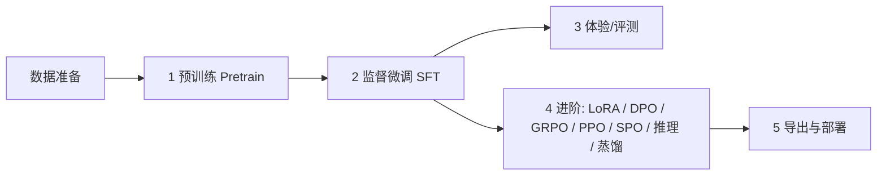

# MiniMind-Next 使用指南 (中文版)

> 本指南面向想要快速体验或从零训练 MiniMind-Next 的用户。
> **约定**：以下所有命令均在**项目根目录**下执行（脚本通过 `os.getcwd()` 定位项目根，路径均以根目录为基准）。

```text
项目结构速览
├── scripts/
│   ├── Deploy/      推理/服务：chat_llm（终端）/ serve_openai_api（API 服务）/ chat_openai_api（客户端）
│   ├── Trainer/     训练：train.py --stage（pretrain/full_sft/lora/dpo/reason/distillation）+ RL（grpo/ppo/spo）
│   ├── Tools/       工具：convert_model（格式转换）/ export_cpp_bin（C++二进制导出）/ cloud_train（云训练）
│   ├── Model/       模型结构 + tokenizer（tokenizer.json 已自带）
│   └── Dataset/     数据处理代码（lm_dataset.py）
├── models/          模型权重保存目录（训练产物输出到这里）
└── resource/        权重与训练数据集存放目录（参考 model_download.md 下载放置）
```

---

## 第一章：快速体验（scripts/Deploy）

`scripts/Deploy/` 下有 3 个脚本（另有 kv_generate / model_loader 等共享支撑模块）：

| 脚本 | 形态 | 适合 |
| --- | --- | --- |
| `chat_llm.py` | 终端聊天（支持跨轮 KV 缓存） | 最快验证模型效果 |
| `serve_openai_api.py` | OpenAI 兼容 API 服务 | 接入第三方 UI / 其他客户端 |
| `chat_openai_api.py` | 终端聊天客户端 | 连上 API 服务后在终端聊天 |

### 0. 准备

```bash
# 1. 安装依赖（torch / transformers 等）
pip install -r requirements.txt

# 2. 准备权重（参考 docs/model_download.md 下载放置在 resource/ 目录下）
#    ▶ 快速体验：直接指定 --save_dir resource/MiniMind2-PyTorch
#    ▶ 或把权重软链进 models/（之后训练产出的权重也都会在 models/）：
ln -s resource/MiniMind2-PyTorch/full_sft_512.pth models/full_sft_512.pth
```

### 1. 终端聊天：chat_llm.py（最快）

```bash
# 用现成 SFT 权重（full_sft_512.pth）体验对话
python scripts/Deploy/chat_llm.py --save_dir resource/MiniMind2-PyTorch --weight full_sft --hidden_size 512

# 预训练模型（raw 续写，不走对话模板）
python scripts/Deploy/chat_llm.py --save_dir resource/MiniMind2-PyTorch --weight pretrain --hidden_size 512

# 推理微调模型 / MoE 模型
python scripts/Deploy/chat_llm.py --save_dir resource/MiniMind2-PyTorch --weight reason --hidden_size 512
python scripts/Deploy/chat_llm.py --save_dir resource/MiniMind2-PyTorch --weight full_sft --use_moe 1 --hidden_size 640
```

启动后直接输入问题逐条对话，**输入空行退出**。

常用参数：`--temperature`（0.85 默认）、`--top_p`（0.85）、`--max_new_tokens`（8192）、`--historys`（携带几轮历史，需为偶数）、`--enable_kv`（启用跨轮 KV 缓存：多轮只算新增 token，加速且保留完整历史）、`--max_cache_tokens`（KV 缓存窗口上限，滑动窗口方案）、`--lora_weight`（挂 LoRA 权重名）。

加载 HF 格式目录（如 `resource/MiniMind2` 或转换产物）用 `--format hf`：

```bash
python scripts/Deploy/chat_llm.py --format hf --load_from resource/MiniMind2
```

> 如果 `models/` 里已有权重（自己训练的或软链的），可省略 `--save_dir`，直接用默认 `--save_dir models`。

### 2. OpenAI 兼容 API：serve_openai_api.py

把 MiniMind 封装成 OpenAI 格式的 HTTP 服务，默认监听 `0.0.0.0:8998`。

```bash
python scripts/Deploy/serve_openai_api.py --save_dir resource/MiniMind2-PyTorch --weight full_sft --hidden_size 512
```

也支持 `--format hf --load_from <HF目录>` 加载 HF 格式模型；`--enable_kv` 可启用跨请求前缀缓存（多轮只 prefill 新增部分）。

起服务后可用 curl 验证：

```bash
curl http://127.0.0.1:8998/v1/chat/completions \
  -H "Content-Type: application/json" \
  -d '{"model":"minimind","messages":[{"role":"user","content":"你好"}]}'
```

支持流式（`"stream": true`）与非流式，返回 `chat.completion` 标准结构。

### 3. 终端聊天客户端：chat_openai_api.py

依赖上面的 API 服务（连接 `http://127.0.0.1:8998/v1`），在终端逐条对话：

```bash
python scripts/Deploy/chat_openai_api.py
```

---

## 第二章：从零训练一个 MiniMind

### 整体流程



> MiniMind 是小模型（26M~145M），普通个人 GPU（如 8GB 显存）即可跑通全流程。
> 建议先用 `*_mini` 数据集快速验证流程，再换完整数据集正式训练。

### 0. 环境与数据

```bash
pip install -r requirements.txt
```

数据请按 [docs/model_download.md](docs/model_download.md) 放置在 `resource/minimind_dataset/`：

| 数据 | 用途 | 对应阶段 |
| --- | --- | --- |
| `pretrain_t2t_mini.jsonl`（1.2GB） | 预训练（快速） | Pretrain |
| `pretrain_t2t.jsonl`（10GB） | 预训练（完整） | Pretrain |
| `sft_t2t_mini.jsonl`（1.6GB） | 指令微调（快速） | SFT |
| `sft_t2t.jsonl`（14GB） | 指令微调（完整） | SFT |
| `dpo.jsonl` | 偏好数据 | DPO |
| `rlaif.jsonl` | RLAIF 强化 | GRPO/PPO/SPO |
| `lora_identity.jsonl` / `lora_medical.jsonl` 等 | LoRA 数据 | LoRA |

Tokenizer 已随项目自带（`scripts/Model/`），**无需训练**；`train_tokenizer.py` 仅供学习。

### 0.5 导出随机基线（可选，用于对比验证）

正式训练前，可以先导出一份**随机初始化的同架构权重**作为 baseline。用它先跑一轮对话/评测，
再与训练后的模型对比，就能直观验证「训练确实让模型学到了东西」：

```bash
# 默认导出 models/random_512.pth（不训练，纯随机初始化）
python scripts/Tools/export_random_model.py
```

随机基线也能直接用推理脚本加载（此时输出通常是乱码/无意义重复，属正常）：

```bash
python scripts/Deploy/chat_llm.py --save_dir models --weight random --hidden_size 512
```

---

### 1. 预训练 Pretrain（`train.py --stage pretrain`）

```bash
# 单卡，快速小规模验证（用 mini 数据；3060 12GB 极致性能配置）
python scripts/Trainer/train.py --stage pretrain \
  --data_path resource/minimind_dataset/pretrain_t2t_mini.jsonl \
  --batch_size 80 --accumulation_steps 4 --use_compile 1

# 多卡 DDP（完整训练用大数据集）
torchrun --nproc_per_node 2 scripts/Trainer/train.py --stage pretrain
```

默认产出：`models/pretrain_512.pth`（`--save_weight pretrain --hidden_size 512`）。

#### 快速冒烟（可选，验证流程用）

```bash
# 1) 切 2 万条子集（几秒）
head -n 20000 resource/minimind_dataset/pretrain_t2t_mini.jsonl > /tmp/pretrain_smoke.jsonl

# 2) 冒烟：约 250 步
python scripts/Trainer/train.py --stage pretrain \
  --data_path /tmp/pretrain_smoke.jsonl --batch_size 80 --use_compile 1 --save_interval 500
```

---

### 2. 监督微调 SFT（`train.py --stage full_sft`）

预训练完成后，基于 `models/pretrain_512.pth` 做指令微调（3060 12GB 最快配置）：

```bash
python scripts/Trainer/train.py --stage full_sft --batch_size 64 --use_compile 1
```

默认：`--from_weight pretrain`（加载 `models/pretrain_512.pth`）、`--data_path sft_t2t_mini.jsonl`、产出 `models/full_sft_512.pth`。

#### 快速冒烟

```bash
head -n 5000 resource/minimind_dataset/sft_t2t_mini.jsonl > /tmp/sft_smoke.jsonl
python scripts/Trainer/train.py --stage full_sft --data_path /tmp/sft_smoke.jsonl --batch_size 64 --use_compile 1
```

---

### 3. 体验刚训好的模型

```bash
# 命令行（默认从 models/ 加载）
python scripts/Deploy/chat_llm.py --weight full_sft --hidden_size 512

# 或起 API 服务
python scripts/Deploy/serve_openai_api.py --weight full_sft --hidden_size 512
```

---

### 4. 进阶训练（可选，按需选择）

```bash
# LoRA 微调
python scripts/Trainer/train.py --stage lora --batch_size 64 --use_compile 1

# DPO 偏好优化
python scripts/Trainer/train.py --stage dpo --batch_size 8 --use_compile 1

# 知识蒸馏 (学生 512 + 教师 768)
python scripts/Trainer/train.py --stage distillation --batch_size 32 --use_compile 1

# 强化学习
python scripts/Trainer/train_grpo.py
python scripts/Trainer/train_ppo.py
python scripts/Trainer/train_spo.py
```

---

### 5. 导出与部署

#### 转为 HuggingFace 格式
```bash
python scripts/Tools/convert_model.py   # 默认把 models/full_sft_512.pth 转成 MiniMind2-Small（Llama HF 格式）
python scripts/Deploy/chat_llm.py --format hf --load_from MiniMind2-Small
```

#### 纯 C++ 原生极速推理（CPU / 零第三方依赖）

项目内置模块化 C++ 原生推理引擎（[src/](src/)），支持 GQA 注意力、KV 缓存与 OpenMP 多核加速：

```bash
# 1. 将 HuggingFace 格式模型导出为二进制 .bin 格式
python scripts/Tools/export_cpp_bin.py --model_dir resource/MiniMind2 --output models/minimind2.bin

# 2. 使用 CMake Presets 编译（输出程序至 bin/ 目录）
cmake --preset default
cmake --build --preset default

# 3. 运行交互式终端聊天
./bin/minimind_cpp models/minimind2.bin
```

---

## 第三章：云端按量计费训练与代码同步

> 数据与权重走 **rsync** 或 `sync_data.py`，代码执行与快速同步走 **`cloud_train.py`**。

**云端代码同步与轻量远程训练**（`scripts/Tools/cloud_train.py`）：

```bash
# 格式：python scripts/Tools/cloud_train.py run <conda_env> <command...>

# 示例 1：在云端的 minimind 环境下运行 SFT 训练
python scripts/Tools/cloud_train.py run minimind python scripts/Trainer/train.py --stage full_sft --batch_size 224 --use_compile 1

# 示例 2：训练完成后云端自动关机（按量计费省钱防漏）
python scripts/Tools/cloud_train.py run minimind python scripts/Trainer/train.py --stage pretrain --batch_size 224 --shutdown
```

### 附：RTX 4090（24GB）各阶段训练最优指令集

```bash
# 1. 预训练
python scripts/Tools/cloud_train.py run minimind python scripts/Trainer/train.py --stage pretrain \
  --data_path resource/minimind_dataset/pretrain_t2t_mini.jsonl \
  --batch_size 224 --accumulation_steps 2 --use_compile 1 --shutdown

# 2. 全量指令微调 SFT
python scripts/Tools/cloud_train.py run minimind python scripts/Trainer/train.py --stage full_sft \
  --batch_size 224 --use_compile 1 --save_interval 500 --shutdown

# 3. LoRA 微调
python scripts/Tools/cloud_train.py run minimind python scripts/Trainer/train.py --stage lora \
  --batch_size 256 --use_compile 1 --shutdown

# 4. DPO 偏好对齐
python scripts/Tools/cloud_train.py run minimind python scripts/Trainer/train.py --stage dpo \
  --batch_size 32 --use_compile 1 --shutdown

# 5. 知识蒸馏 (Distillation)
python scripts/Tools/cloud_train.py run minimind python scripts/Trainer/train.py --stage distillation \
  --batch_size 96 --use_compile 1 --shutdown
```

---

## 常见问题

- **找不到 `models/xxx.pth`**：确认权重在 `models/` 下，或用 `--save_dir resource/MiniMind2-PyTorch` 指向现成权重。
- **多卡训练**：`train.py --stage <stage>` 与 `train_grpo/ppo/spo.py` 都支持 `torchrun --nproc_per_node N scripts/Trainer/<入口>.py`。
- **断点续训**：加 `--from_resume 1`，自动从 `checkpoints/` 恢复。
