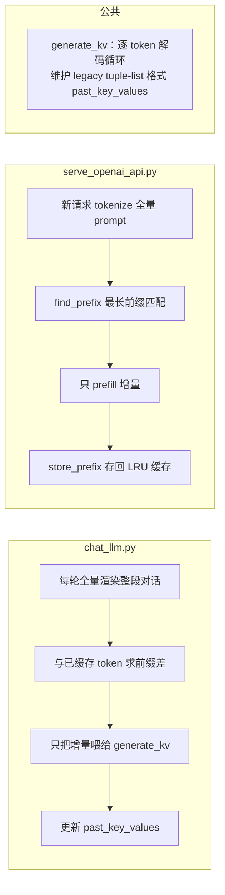

# MiniMind 跨轮 KV Cache 与 Prefix Cache 实现排障记录

> 本文档完整记录本次「多轮对话 KV/前缀缓存」功能的实现、过程中出现的问题、排查过程与最终解决方案。
> 涉及文件：`scripts/Deploy/chat_llm.py`、`scripts/Deploy/kv_generate.py`、`scripts/Deploy/model_loader.py`、`scripts/Deploy/serve_openai_api.py`、`scripts/Deploy/chat_openai_api.py`。

---

## 1. 背景与目标

MiniMind 的推理脚本默认「每轮把整段历史重新 prefill」，多轮对话越聊越慢（$O(N^2)$ 累计）。本次要实现：

1. **`chat_llm.py --enable_kv`**：终端多轮对话，跨轮维护 KV cache，只计算新增 token。
2. **`serve_openai_api.py --enable_kv`**：OpenAI 兼容 API 服务，跨**请求**复用前缀 K/V（prefix caching）。
3. **`chat_openai_api.py`**：客户端匹配多轮，让服务端能命中前缀缓存。

---

## 2. 最终方案总览



- **核心思想**：缓存「已进入模型的完整 token 流 + 对应 K/V」；下一轮/下一个请求只把「新 token 增量」喂给模型，历史 K/V 直接复用。
- **正确性保证**：前缀不匹配（历史被裁剪 / re-encode 漂移 / 截断）时自动回退全量重算，结果永远与全量一致。

---

## 3. 问题与排查过程

### 3.1 transformers 4.57 的 `DynamicCache` 与本模型 legacy 格式不兼容

**现象 / 背景**

跨轮要复用 `past_key_values`，但发现 `MiniMindForCausalLM` 继承 `GenerationMixin`（本地仓库没有上游的自定义 `generate`），直接依赖 `model.generate()` 无法拿到可复用的跨请求缓存。

**排查**

- 读 `scripts/Model/model_minimind.py` 第 529 行：

  ```python
  if hasattr(past_key_values, 'layers'): past_key_values = None
  ```

- 确认环境：minimind 环境为 `transformers 4.57.1`、`torch 2.6.0+cu124`。

**根因**

HF `generate` 内部用 `DynamicCache`（带 `.layers` 属性），而本模型 forward 会把它**直接置为 None**——模型只接受 legacy 格式 `List[Tuple[k, v]]`（每层一个 `(k, v)` 元组）。所以跨轮 KV 不能靠 `model.generate()`，必须自己写逐 token 解码循环，手动传/收 tuple 列表格式。

**解决**

实现 `generate_kv()`（`scripts/Deploy/kv_generate.py`），逐 token 调 `model(input_ids=..., past_key_values=..., use_cache=True)`，手动采样（temperature / top_p / top_k / repetition_penalty / multinomial），与上游 `jingyaogong/minimind` 自定义 `generate` 的采样逻辑保持一致。模型 forward 原生支持 `start_pos`、K/V concat、因果 mask，天然适配。

---

### 3.2 增量拼接 ≠ 全量渲染：硬编码片段丢掉了 assistant 后的 `<|im_end|>`

**现象**

最初想硬编码每轮新增片段：`'<|im_start|>user\n{新问题}<|im_end|>\n<|im_start|>assistant\n'`，直接拼到上一轮缓存后面。用 tokenizer 验证「增量 token 序列 == 全量渲染 token 序列」时返回 **False**。

**排查**

写验证脚本对比：

```
增量:  ...<|im_start|>assistant\n{回复}<|im_end|>   ← 缓存以生成的 <|im_end|> 结尾
全量:  ...<|im_start|>assistant\n{回复}<|im_end|>\n<|im_start|>user\n...
```

发现 chat template 在 **assistant 轮后面也会渲染 `<|im_end|>\n`**，而硬编码片段少了这个换行/结束符，导致 token 序列错位。

**解决**

放弃硬编码拼接，改为**「全量渲染 + 前缀求差」**：

```python
full_ids  = tokenizer(tokenizer.apply_chat_template(conversation, tokenize=False, add_generation_prompt=True)).input_ids
cached    = kv_all_ids[0].tolist()                      # 已进 cache 的 token
if full_ids[:len(cached)] == cached:                    # 前缀一致 → 增量
    chunk_ids = full_ids[len(cached):]                  # 只喂新增
else:                                                   # 前缀不匹配 → 全量重算
    kv_cache, chunk_ids = None, full_ids
```

该方案无论模板细节（assistant 后是否跟 `<|im_end|>`、模型是否生成 eos、历史是否被裁剪、re-encode 是否漂移）都保证**语义与全量重算完全一致**。验证脚本确认：含 eos / 无 eos（截断）/ 三轮场景 `prefix_ok` 均为 True。

---

### 3.3 `serve_openai_api.py` 的 `[-max_tokens:]` 字符截断导致空回复

**现象**

测试 `serve_openai_api.py --enable_kv` 时，第一轮「你好」返回**空回复**（`finish_reason: stop`）。`chat_llm.py` 里同样的 `generate_kv` 却正常。

**排查（关键）**

1. 先怀疑前缀缓存 bug——但服务端日志显示 `前缀命中 0/15`，三次请求全是 miss，与缓存命中无关。
2. 独立脚本对完整 prompt 调 `generate_kv`，所有种子都正常（prompt = 25 token）。
3. 对比发现：服务端日志里「你好」的 prompt 只有 **15 token**，而独立脚本是 **25 token**。
4. 差异来自服务端这行：`new_prompt = apply_chat_template(...)[-max_tokens:]` —— 它按**字符**把模板字符串截成最后 `max_tokens` 个字符。测试客户端设 `max_tokens=64`，109 字符的模板被截成 64 字符，`<|im_start|>system\nYou are a helpful assistant...` 系统提示被切掉，prompt 变成残缺的 `'t<|im_end|>\n<|im_start|>user\n你好...'`。
5. 用截断后的残缺 prompt 复现：**所有种子都输出空回复**。

**根因**

`max_tokens` 本意是限制「生成长度」，却被用来按字符截断「输入 prompt」，且从左截断会切掉系统提示，产生畸形 prompt，导致模型第一个 token 就采样到 eos。

**解决**

删除两处 `[-max_tokens:]` 字符截断，靠 tokenizer 自带 `truncation=True`（上限 32768）兜底。既修复空回复，也避免截断破坏前缀对齐。

---

### 3.4 `TextStreamer(skip_prompt=True)` 吞掉第一个生成 token

**现象**

流式客户端（`chat_openai_api.py`）多轮：
- 非流式（curl/脚本）第 2 轮能命中缓存（`34/52`）；
- 流式客户端第 2 轮却是 `0/51` 全量重算；
- 且第 1 轮回复**缺开头**：「你好」只回显「！有什么我可以帮助你的吗？」（少了「你好」）。

**排查**

1. 先验证 re-encode 无损性：对几段回复 `decode → re-encode` 均无损，排除文本往返问题。
2. 本地复现流式：用一个 `TextStreamer` 子类录制流式文本，与生成的原始 token 对比，发现**第一个 token（5134「你好」）在流式文本里丢失**，导致客户端存回的 `assistant` 内容缺开头，第 2 轮前缀对不上。
3. 读 `TextStreamer` 源码：`skip_prompt=True` 时，**第一次 `put()` 会被当作 prompt 直接跳过**（`next_tokens_are_prompt` 标志）。
4. 原版 `model.generate(..., streamer=...)` 会先 `streamer.put(prompt_ids)`（被 skip_prompt 跳过并解锁），再逐 token `put` 生成结果；而我的 `generate_kv` **只 `put` 生成的 token**，于是第一个生成 token 被当成 prompt 吞掉。

**解决**

KV 流式路径里，进入 `generate_kv` 前先 `streamer.put(inputs.input_ids)`，让 skip_prompt 逻辑跳过 prompt 并解锁后续 token：

```python
if streamer is not None:
    streamer.put(inputs.input_ids)   # 模拟 HF generate：先 put prompt（被跳过），避免吞掉第一个生成 token
```

修复后客户端第 2/3/4 轮全部命中缓存（`34/52`、`61/77`、`88/100`）。

---

### 3.5 客户端默认只发最后一条消息，前缀永远匹配不上

**现象**

`chat_openai_api.py` 默认 `history_messages_num = 0`，此时：

```python
messages = conversation_history[-(history_messages_num or 1):]   # → 只发最后 1 条
```

即每轮只发当前 query，历史从不携带，服务端前缀自然永远匹配不上。

**解决**

改为 `0` 时发送**完整历史**：

```python
messages = conversation_history[-history_messages_num:] if history_messages_num else conversation_history,
```

并更新注释说明（配合服务端 `--enable_kv` 前缀缓存）。

---

### 3.6 附：`conda run` 不转发 stdin

**现象**

`printf '...' | conda run -n minimind python scripts/...` 报 `EOFError: EOF when reading a line`。

**根因**

`conda run` 不把管道 stdin 转发给子进程（与代码无关）。

**解决**

改用环境内 python 直连：`/home/xavier/miniforge3/envs/minimind/bin/python ...`。

---

## 4. 关键设计决策小结

| 决策 | 原因 |
| --- | --- |
| 自写 `generate_kv` 而非 `model.generate` | 模型丢弃 HF `DynamicCache`，只接受 legacy tuple-list；且需手动跨轮传/收缓存 |
| 「全量渲染 + 前缀求差」而非硬编码拼接 | 模板细节（assistant 后 `<|im_end|>\n`）难以硬编码对齐，求差法保证语义等价 |
| 前缀不匹配自动回退全量重算 | 对 re-encode 漂移、历史裁剪等不可控因素兜底，永远正确 |
| server 用 LRU 缓存（最多 8 个会话） | 支持多个并发会话，命中后提到最前，超限淘汰最久未用 |
| 客户端默认发完整历史 | 让服务端能按 token 前缀匹配并复用 K/V |

---

## 5. 验证结果

**`chat_llm.py --enable_kv`（终端）**

| 轮次 | use_delta | 新增 token | 缓存总长 |
| --- | --- | --- | --- |
| 1（冷启动） | False（全量 prefill） | 25 | 25 |
| 2 | True | 18 | 53 |
| 3 | True | 19 | 88 |

**`serve_openai_api.py --enable_kv` + `chat_openai_api.py`（流式多轮）**

| 轮次 | 前缀命中 | 实际 prefill | 客户端回复 |
| --- | --- | --- | --- |
| 1 | 0/25 | 25 | 你好！有什么我可以帮助你的吗？ |
| 2 | 34/52 | 18 | 我叫做"晴天"。 |
| 3 | 61/77 | 16 | 好的，我叫做"晴天"。 |
| 4 | 88/100 | 12 | 我叫做"晴天"。 |

多轮历史 K/V 完全复用，每轮只算 12-18 个新 token；流式与非流式均验证通过。

---

## 6. 遗留问题与注意点

- **命中依赖 re-encode 无损**：客户端发回文本 → 服务端重新 tokenize，若与生成时 token 序列不一致（罕见），该轮自动回退全量 prefill（结果正确，无加速）。
- **内存**：每个会话的 K/V 随对话增长（KV cache 固有代价）；LRU 最多同时缓存 8 个会话，但单个会话内 K/V 不设上限。
- **无 `setup_seed` 时采样随机**：服务端未设种子，同一 prompt 多次请求结果不同，属正常现象。
- **超长 prompt**：tokenizer `truncation=True` 从右侧截断到 32768，若历史极长可能切掉最新消息（边缘场景，与本次功能无关）。
- **模型加载已统一到 `model_loader.py`**（`serve_openai_api.py` 已删除本地 `init_model`，`chat_llm.py` / `serve_openai_api.py` 共用同一个加载函数）：
  - **删除了无意义的 `--max_seq_len` 参数**：模型序列长度应由 config 的 `max_position_embeddings` 决定，而 `max_seq_len` 传给 `MiniMindConfig` 只会落入 `**kwargs` 被 `PretrainedConfig` 用 `setattr` 存到 config 上、模型从不读取，是 no-op；
  - **`torch.load` 改用 `weights_only=True`（只加载参数）**：已验证全部 `.pth` 权重都是纯 tensor 的 state_dict（75 个 tensor、0 个非 tensor），`weights_only=True` 安全可加载，且比 `weights_only=False`（允许任意 pickle 对象）更安全。

---

## 7. 方案B：滑动窗口 KV（`--enable_kv` + `--max_cache_tokens`）

让 KV cache「兼有只记录最近几条历史」的能力（内存有界 + 绝大多数轮次增量）：

- **模型 `MiniMindModel.forward` 新增 `position_offset`**：缓存被裁剪掉前段后，`start_pos = 缓存长度 + position_offset`，补回全局 RoPE 位置（`MiniMindForCausalLM.forward` 透传，默认 0 向后兼容）。
- **`generate_kv` 透传 `position_offset`**（默认 0）。
- **`chat_llm.py` 新增 `--max_cache_tokens W`**（需配合 `--enable_kv`）：
  - 每轮按模板分隔符构造**增量 user 片段**（`window_chunk_text`：上一轮已生成 eos → 前缀 `\n`；被截断未出 eos → 补 `<|im_end|>\n`；首轮走完整模板）；
  - token 追加进缓存 → `generate_kv` 只 prefill 新增块；
  - 生成后 `trim_window` 把缓存**前段淘汰**到 ≤ W，`pos_offset += 淘汰数`。
- **语义**：模型只看到最近 W 个 token（滑动窗口记忆），内存有界；与「保留全部历史」的纯 KV 模式二选一。

**已修复的 bug（冒烟测试抓到的维度错误）**：
- 缓存 K/V 布局为 `[batch, seq, kv_heads, head_dim]`，**seq 在 dim 1**；
- 前段淘汰必须 `k[:, drop:, :, :]`（沿 dim 1）；
- 曾误写成 `k[:, :, drop:, :]`（沿 dim 2），把 kv_heads 裁空 → 缓存变 `[1, 103, 0, 64]` → 下一轮 `torch.cat` 报 `Expected size 0 but got size 2`。

**验证**：`tests/test_chat_window.py`（5 个用例）+ 真实权重 6 轮冒烟，缓存始终 ≤ W、`pos_offset` 递增（0→39→81→119→137）、非窗口 KV 路径回归正常。
