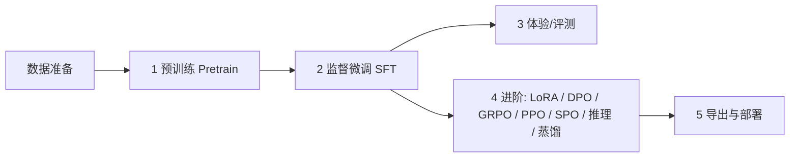

# MiniMind 使用指南

> 本指南面向想要快速体验或从零训练 MiniMind 的用户。
> **约定**：以下所有命令均在**项目根目录**下执行（脚本通过 `os.getcwd()` 定位项目根，路径均以根目录为基准）。

```text
项目结构速览
├── scripts/
│   ├── Deploy/      推理/服务：chat_llm（终端）/ serve_openai_api（API 服务）/ chat_openai_api（客户端）
│   ├── Trainer/     训练：train.py --stage（pretrain/full_sft/lora/dpo/reason/distillation）+ RL（grpo/ppo/spo）
│   ├── Tools/       工具：convert_model（权重格式转换）
│   ├── Model/       模型结构 + tokenizer（tokenizer.json 已自带）
│   └── Dataset/     数据处理代码（lm_dataset.py）
├── models/          默认模型权重保存/加载目录（训练产物输出到这里）
└── resource/
    ├── MiniMind2-PyTorch/   现成预训练权重（.pth）
    └── minimind_dataset/    现成数据集（.jsonl）
```

---

## 第一章：快速体验（scripts/Deploy）

`scripts/Deploy/` 下有 3 个脚本（另有 kv_generate / model_loader 等共享支撑模块）：

| 脚本 | 形态 | 适合 |
| --- | --- | --- |
| `chat_llm.py` | 终端聊天（支持跨轮 KV 缓存） | 最快验证模型效果 |
| `serve_openai_api.py` | OpenAI 兼容 API 服务 | 接入第三方 UI / 其他客户端 |
| `chat_openai_api.py` | 终端聊天客户端 | 连上 API 服务后在终端聊天 |

### 0. 准备

```bash
# 1. 安装依赖（torch / transformers 等）
pip install -r requirements.txt

# 2. 准备权重
#    项目自带一份现成预训练权重在 resource/MiniMind2-PyTorch/（full_sft_512.pth 等 13 个）
#    默认加载目录是 models/，目前为空。
#    ▶ 快速体验：直接指定 --save_dir resource/MiniMind2-PyTorch
#    ▶ 或把权重软链进 models/（之后训练产出的权重也都会在 models/）：
ln -s resource/MiniMind2-PyTorch/full_sft_512.pth models/full_sft_512.pth
```

### 1. 终端聊天：chat_llm.py（最快）

```bash
# 用现成 SFT 权重（full_sft_512.pth）体验对话
python scripts/Deploy/chat_llm.py --save_dir resource/MiniMind2-PyTorch --weight full_sft --hidden_size 512

# 预训练模型（raw 续写，不走对话模板）
python scripts/Deploy/chat_llm.py --save_dir resource/MiniMind2-PyTorch --weight pretrain --hidden_size 512

# 推理微调模型 / MoE 模型
python scripts/Deploy/chat_llm.py --save_dir resource/MiniMind2-PyTorch --weight reason --hidden_size 512
python scripts/Deploy/chat_llm.py --save_dir resource/MiniMind2-PyTorch --weight full_sft --use_moe 1 --hidden_size 640
```

启动后直接输入问题逐条对话，**输入空行退出**。

常用参数：`--temperature`（0.85 默认）、`--top_p`（0.85）、`--max_new_tokens`（8192）、`--historys`（携带几轮历史，需为偶数）、`--enable_kv`（启用跨轮 KV 缓存：多轮只算新增 token，加速且保留完整历史）、`--max_cache_tokens`（KV 缓存窗口上限，滑动窗口方案）、`--lora_weight`（挂 LoRA 权重名）。

加载 HF 格式目录（如 `resource/MiniMind2` 或转换产物）用 `--format hf`：

```bash
python scripts/Deploy/chat_llm.py --format hf --load_from resource/MiniMind2
```

> 如果 `models/` 里已有权重（自己训练的或软链的），可省略 `--save_dir`，直接用默认 `--save_dir models`。

### 2. OpenAI 兼容 API：serve_openai_api.py

把 MiniMind 封装成 OpenAI 格式的 HTTP 服务，默认监听 `0.0.0.0:8998`。

```bash
python scripts/Deploy/serve_openai_api.py --save_dir resource/MiniMind2-PyTorch --weight full_sft --hidden_size 512
```

也支持 `--format hf --load_from <HF目录>` 加载 HF 格式模型；`--enable_kv` 可启用跨请求前缀缓存（多轮只 prefill 新增部分）。

起服务后可用 curl 验证：

```bash
curl http://127.0.0.1:8998/v1/chat/completions \
  -H "Content-Type: application/json" \
  -d '{"model":"minimind","messages":[{"role":"user","content":"你好"}]}'
```

支持流式（`"stream": true`）与非流式，返回 `chat.completion` 标准结构。

### 3. 终端聊天客户端：chat_openai_api.py

依赖上面的 API 服务（连接 `http://127.0.0.1:8998/v1`），在终端逐条对话：

```bash
python scripts/Deploy/chat_openai_api.py
```

---

## 第二章：从零训练一个 MiniMind

### 整体流程



> MiniMind 是小模型（26M~145M），普通个人 GPU（如 8GB 显存）即可跑通全流程。
> 建议先用 `*_mini` 数据集快速验证流程，再换完整数据集正式训练。

### 0. 环境与数据

```bash
pip install -r requirements.txt
```

数据已内置在 `resource/minimind_dataset/`（无需下载）：

| 数据 | 用途 | 对应阶段 |
| --- | --- | --- |
| `pretrain_t2t_mini.jsonl`（1.2GB） | 预训练（快速） | Pretrain |
| `pretrain_t2t.jsonl`（10GB） | 预训练（完整） | Pretrain |
| `sft_t2t_mini.jsonl`（1.6GB） | 指令微调（快速） | SFT |
| `sft_t2t.jsonl`（14GB） | 指令微调（完整） | SFT |
| `dpo.jsonl` | 偏好数据 | DPO |
| `rlaif.jsonl` | RLAIF 强化 | GRPO/PPO/SPO |
| `lora_identity.jsonl` / `lora_medical.jsonl` 等 | LoRA 数据 | LoRA |

Tokenizer 已随项目自带（`scripts/Model/`），**无需训练**；`train_tokenizer.py` 仅供学习。

### 0.5 导出随机基线（可选，用于对比验证）

正式训练前，可以先导出一份**随机初始化的同架构权重**作为 baseline。用它先跑一轮对话/评测，
再与训练后的模型对比，就能直观验证「训练确实让模型学到了东西」：

```bash
# 默认导出 models/random_512.pth（不训练，纯随机初始化）
python scripts/Tools/export_random_model.py
```

随机基线也能直接用推理脚本加载（此时输出通常是乱码/无意义重复，属正常）：

```bash
python scripts/Deploy/chat_llm.py --save_dir models --weight random --hidden_size 512
```

> 换不同规模/架构的随机基线：`--hidden_size 768 --num_hidden_layers 16`（Base 规模）或
> `--use_moe 1 --hidden_size 640`（MoE 规模）。训练后同样用 `--save_dir models --weight <阶段>` 加载，
> 同一 prompt 对比输出即可看出训练效果。

### 1. 预训练 Pretrain（`train.py --stage pretrain`）

```bash
# 单卡，快速小规模验证（用 mini 数据；3060 12GB 极致性能配置）
python scripts/Trainer/train.py --stage pretrain \
  --data_path resource/minimind_dataset/pretrain_t2t_mini.jsonl \
  --batch_size 80 --accumulation_steps 4 --use_compile 1

# 多卡 DDP（完整训练用大数据集）
torchrun --nproc_per_node 2 scripts/Trainer/train.py --stage pretrain
```

> 单卡性能参数（RTX 3060 12GB 实测）：`--batch_size 80`（96 是硬上限、104 会 OOM；配
> `--use_compile 1` 后 80 更稳）、`--accumulation_steps 4`（有效 batch ≈ 320，贴近原 32×8=256，
> 学习率不用动）、`--use_compile 1`（提速 1.5~2×）。三步叠加约 **3~4×**——一个 epoch 从
> 默认的 ~2.3h 降到 ~40~50min。若不加 compile 可把 batch 推到 96。

默认产出：`models/pretrain_512.pth`（`--save_weight pretrain --hidden_size 512`）。
常用参数：`--epochs`、`--batch_size`、`--learning_rate`、`--max_seq_len`、`--use_moe 1`（MoE）、`--from_weight`（基于已有权重续训）、`--from_resume 1`（断点续训，存档在 `checkpoints/`）。

#### 快速冒烟（可选，验证流程用）

`pretrain_t2t_mini` 有 **127 万条** ≈ 39695 步/epoch（RTX 3060 上约 2.3h/epoch）。只想验证流程时，
切一个小子集跑几百步即可——看到 loss 稳定下降（如 7.x → 6.x）就说明流程正常：

```bash
# 1) 切 2 万条子集（几秒）
head -n 20000 resource/minimind_dataset/pretrain_t2t_mini.jsonl > /tmp/pretrain_smoke.jsonl

# 2) 冒烟：约 250 步，3060 上 1~2 分钟（batch 80 + compile 已是最快）
python scripts/Trainer/train.py --stage pretrain \
  --data_path /tmp/pretrain_smoke.jsonl --batch_size 80 --use_compile 1 --save_interval 500
```

正式训练再换回完整 mini 数据；中途 Ctrl-C 后可加 `--from_resume 1` 从 `checkpoints/` 续跑。
同样的子集技巧也适用于 `full_sft` 等其他 SFT 阶段（`head -n N sft_t2t_mini.jsonl > /tmp/...`）。

##### 冒烟后试效果

冒烟训完（`models/pretrain_512.pth`）想立刻上手试试：

```bash
# 预训练模型是「续写」模型：输入一句开头，它接着往下写（不是一问一答）
python scripts/Deploy/chat_llm.py --save_dir models --weight pretrain --hidden_size 512 --max_new_tokens 128
```

> ⚠️ 两点预期管理：① 预训练只学会了「接上文」，不会问答；② 冒烟只训了几百步，输出大概率还是
> 乱码/重复——这正常。它的价值在于**和随机基线对比**（`--weight random` 更乱），能看出模型确实开始「学」了。
> 想要真正的问答对话，先做 SFT：`python scripts/Trainer/train.py --stage full_sft`（可用同样的子集技巧
> 快速跑一遍），再用 `--weight full_sft` 聊。

### 2. 监督微调 SFT（`train.py --stage full_sft`）

预训练完成后，基于 `models/pretrain_512.pth` 做指令微调（3060 12GB 最快配置）：

```bash
python scripts/Trainer/train.py --stage full_sft --batch_size 64 --use_compile 1
```

默认：`--from_weight pretrain`（加载 `models/pretrain_512.pth`）、`--data_path sft_t2t_mini.jsonl`、产出 `models/full_sft_512.pth`。
训练完成后你就有了一个**能对话的模型**。

> ⚠️ 默认 batch 16 会非常慢（90 万条 ×2 epoch ≈ 11 万步）。务必加大 batch：上面 batch 64 约 **1~1.5h** 跑完 2 epoch。

#### 快速冒烟（可选，验证流程用）

`sft_t2t_mini` 有 **90 万条**，直接跑偏慢。切个子集快速验证流程（batch 64 下约几十步）：

```bash
head -n 5000 resource/minimind_dataset/sft_t2t_mini.jsonl > /tmp/sft_smoke.jsonl
python scripts/Trainer/train.py --stage full_sft --data_path /tmp/sft_smoke.jsonl --batch_size 64 --use_compile 1
```

看到 loss 稳定下降（明显低于随机基线）即说明流程正常；正式训练换回完整数据。
> 若报 `TypeError: Couldn't cast array ...`，是数据里混有函数调用样本（`tools`/`tool_calls`）导致 datasets 推断 schema 失败，已由 lm_dataset.py 手动 JSONL 加载修复，无需处理。

### 3. 体验刚训好的模型

```bash
# 命令行（默认就从 models/ 加载）
python scripts/Deploy/chat_llm.py --weight full_sft --hidden_size 512

# 或起 API 服务
python scripts/Deploy/serve_openai_api.py --weight full_sft --hidden_size 512
```

### 4. 进阶训练（可选，按需选择）

SFT 系阶段（预训练 / 微调 / LoRA / DPO / 推理 / 蒸馏）统一走 `train.py --stage`：

```bash
# LoRA 微调：基于 full_sft，挂载轻量可插拔模块（数据 lora_identity.jsonl 等）
python scripts/Trainer/train.py --stage lora --batch_size 64 --use_compile 1

# DPO 偏好优化：让模型更符合人类偏好（数据 dpo.jsonl，基于 full_sft；seq 1024 较长）
python scripts/Trainer/train.py --stage dpo --batch_size 8 --use_compile 1

# 推理微调（reason）：⚠️ 需要自备 r1_mix_1024.jsonl（当前资源目录未提供；seq 720）
python scripts/Trainer/train.py --stage reason --batch_size 32 --use_compile 1

# 蒸馏（用大模型输出精炼小模型，数据 sft_t2t_mini.jsonl；学生+教师双模型）
python scripts/Trainer/train.py --stage distillation --batch_size 32 --use_compile 1

# RL 阶段（多模型 + reward，独立脚本；⚠️ 瓶颈在生成长度与 1.8B reward 模型，
# 加大 batch 帮助有限，建议先切子集验证 + 留足时间）
python scripts/Trainer/train_grpo.py
python scripts/Trainer/train_ppo.py
python scripts/Trainer/train_spo.py
```

#### 快速冒烟（可选，各阶段通用）

> 同一套「切子集 → 快速跑几步」技巧适用于所有 SFT 系阶段：先 `head -n N` 切小子集，
> 冒烟看到 loss 稳定下降即可；正式训练再换回完整数据。以下均默认 `--from_weight` 指向正确前序权重。

```bash
# 通用切子集（条数按阶段调整）
head -n 5000 resource/minimind_dataset/sft_t2t_mini.jsonl  > /tmp/sft_smoke.jsonl     # full_sft / distillation
head -n 3000 resource/minimind_dataset/dpo.jsonl           > /tmp/dpo_smoke.jsonl
head -n 2000 resource/minimind_dataset/rlaif.jsonl         > /tmp/rl_smoke.jsonl
head -n 1000 resource/minimind_dataset/lora_medical.jsonl  > /tmp/lora_smoke.jsonl

# LoRA：默认 lora_identity.jsonl 仅 91 条，本身即冒烟量级；也可用 medical 子集
python scripts/Trainer/train.py --stage lora --batch_size 64
python scripts/Trainer/train.py --stage lora --data_path /tmp/lora_smoke.jsonl --batch_size 64

# DPO：seq 1024 / batch 8 较吃资源，子集切小一点
python scripts/Trainer/train.py --stage dpo --data_path /tmp/dpo_smoke.jsonl --batch_size 8

# 推理微调 reason：需自备 r1_mix_1024.jsonl（当前资源目录未提供），先切子集验证
head -n 2000 <你的 r1_mix_1024.jsonl> > /tmp/reason_smoke.jsonl
python scripts/Trainer/train.py --stage reason --data_path /tmp/reason_smoke.jsonl --batch_size 32

# 蒸馏：需先有对应规模学生/教师权重（默认 full_sft_512.pth / full_sft_768.pth）
python scripts/Trainer/train.py --stage distillation --data_path /tmp/sft_smoke.jsonl --batch_size 32

# RL（grpo/ppo/spo）：独立脚本，同样支持 --data_path 切子集，看 reward/kl 是否合理波动
python scripts/Trainer/train_grpo.py --data_path /tmp/rl_smoke.jsonl
python scripts/Trainer/train_ppo.py  --data_path /tmp/rl_smoke.jsonl
python scripts/Trainer/train_spo.py  --data_path /tmp/rl_smoke.jsonl
```

> 这些阶段按流水线依赖前序权重（如 LoRA 需要 `models/full_sft_512.pth`），默认 `--from_weight` 已指向正确前序，产出的权重名分别是 `dpo_512.pth` / `grpo_512.pth` / `ppo_actor_512.pth` / `spo_512.pth` / `reason_512.pth` 等，全部在 `models/`。

### 5. 导出与部署

训练产出的 `models/*.pth` 是 PyTorch 原生格式，如需 HuggingFace/第三方生态兼容，用 `scripts/Tools/convert_model.py` 转换：

```bash
python scripts/Tools/convert_model.py   # 默认把 models/full_sft_512.pth 转成 MiniMind2-Small（Llama HF 格式）
```

转换后的 HF 目录可直接用 `--format hf` 加载（`chat_llm.py` / `serve_openai_api.py` 均支持），例如：

```bash
python scripts/Deploy/chat_llm.py --format hf --load_from MiniMind2-Small
```

> `convert_model.py` 还提供 `convert_torch2transformers_minimind`（MoE 模型转 HF）与 `convert_transformers2torch`（HF 转回 .pth）两个函数，按需改 main 里的调用。

### 附：batch × 显存规格对照表（单卡全参训练，seq≈340）

> 数值为**单步最大 batch**（全参 + AdamW + bf16；配 `--use_compile 1` 建议取下限）。
> 梯度累积不占显存，有效 batch 用 `--accumulation_steps` 放大即可。
> 模型对应：`512 = Small(25M)`、`768 = Base(104M)`、`640-MoE = MoE(145M)`。
> **512 列为实测**，768 / MoE 为估算（后续可在 GPU 空闲时复测修正）。

| 显存 | 512（25M，实测） | 768（104M） | 640-MoE（145M） |
| --- | --- | --- | --- |
| 12GB（3060） | 96（安全 80） | 32~48 | 32~48 |
| 16GB | ~128 | 64~80 | 64~96 |
| 24GB（3090/4090） | ~224 | 96~128 | 128~160 |
| 32GB | ~320 | 128~160 | 192~224 |
| 48GB | ~512 | 256 | 256~384 |
| 80GB（A100/H100） | ~768 | 384~512 | 512~640 |

> 想更省显存或换更大模型：用 LoRA（`--stage lora`）可大幅降低占用；纯推理只需约 1/10 显存。

---

## 第四章：云迁移 / 数据同步

> 代码走 **git**，数据/权重/续训档走 **rsync**——两者解耦，避免把几十 GB 数据塞进 git。

**云端目标配置**（`scripts/Tools/cloud_config.py`，含凭据已被 gitignore）：

```python
HOST = '1.2.3.4'     # 必填：云端 SSH 主机
USER = 'xavier'      # SSH 用户（留空 = 当前 $USER）
PORT = 22
PATH = '~/minimind'  # 云端项目路径
PASSWORD = ''        # 可选：SSH 密码（非空时用 sshpass；推荐 SSH 密钥免密留空）
```

**代码迁移**（git）：

```bash
git remote add origin <云端仓库地址>
git push -u origin master
```

**数据/权重同步**（`scripts/Tools/sync_data.py`，项目根目录执行）：

```bash
python scripts/Tools/sync_data.py pull              # 云端 → 本地
python scripts/Tools/sync_data.py push              # 本地 → 云端
python scripts/Tools/sync_data.py pull --dirs resource models   # 只同步部分目录
python scripts/Tools/sync_data.py pull --dry-run                # 预览不动手
```

**云端代码同步与轻量远程训练**（`scripts/Tools/cloud_train.py`）：

> 大文件（`resource/` 数据与 `models/` 权重）由你自行按需通过 `sync_data.py` 或手动 rsync 传输；
> 本工具专注于：**毫秒级自动增量同步本地代码 (`scripts/`) → 云端激活 Conda 环境 → 触发训练并实时回传日志**。

```bash
# 格式：python scripts/Tools/cloud_train.py run <conda_env> <command...>

# 示例 1：在云端的 minimind 环境下运行 SFT 训练
python scripts/Tools/cloud_train.py run minimind python scripts/Trainer/train.py --stage full_sft --batch_size 224 --use_compile 1

# 示例 2：多卡 DDP 训练
python scripts/Tools/cloud_train.py run minimind torchrun --nproc_per_node 2 scripts/Trainer/train.py --stage full_sft

# 示例 3：训练完成后云端自动关机（省钱防漏）
python scripts/Tools/cloud_train.py run minimind python scripts/Trainer/train.py --stage pretrain --batch_size 224 --shutdown
```

配置优先级：`cloud_config.py` > 环境变量（`CLOUD_HOST/USER/PORT/PATH/PASSWORD`）> 默认值。
密码：配置 `PASSWORD` 时经 `sshpass` 认证（未安装会提示）；长期推荐 SSH 密钥免密。

## 常见问题

- **找不到 `models/xxx.pth`**：确认权重在 `models/` 下，或用 `--save_dir resource/MiniMind2-PyTorch` 指向现成权重（`chat_llm` / `serve_openai_api`）。
- **多卡训练**：`train.py --stage <stage>` 与 `train_grpo/ppo/spo.py` 都支持 `torchrun --nproc_per_node N scripts/Trainer/<入口>.py`。
- **显存不足**：降低 `--batch_size`、`--max_seq_len`，或用 mini 数据、`--hidden_size 512` 的小模型。
- **断点续训**：加 `--from_resume 1`，自动从 `checkpoints/` 恢复。
