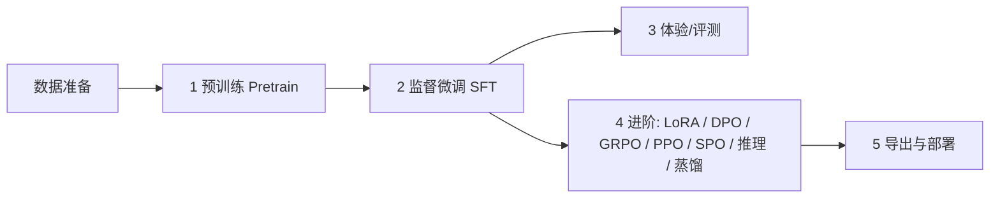

# MiniMind 使用指南

> 本指南面向想要快速体验或从零训练 MiniMind 的用户。
> **约定**：以下所有命令均在**项目根目录**下执行（脚本通过 `os.getcwd()` 定位项目根，路径均以根目录为基准）。

```text
项目结构速览
├── scripts/
│   ├── Deploy/      推理/服务：chat_llm（终端）/ serve_openai_api（API 服务）/ chat_openai_api（客户端）
│   ├── Trainer/     训练：train.py --stage（pretrain/full_sft/lora/dpo/reason/distillation）+ RL（grpo/ppo/spo）
│   ├── Tools/       工具：convert_model（权重格式转换）
│   ├── Model/       模型结构 + tokenizer（tokenizer.json 已自带）
│   └── Dataset/     数据处理代码（lm_dataset.py）
├── models/          默认模型权重保存/加载目录（训练产物输出到这里）
└── resource/
    ├── MiniMind2-PyTorch/   现成预训练权重（.pth）
    └── minimind_dataset/    现成数据集（.jsonl）
```

---

## 第一章：快速体验（scripts/Deploy）

`scripts/Deploy/` 下有 3 个脚本（另有 kv_generate / model_loader 等共享支撑模块）：

| 脚本 | 形态 | 适合 |
| --- | --- | --- |
| `chat_llm.py` | 终端聊天（支持跨轮 KV 缓存） | 最快验证模型效果 |
| `serve_openai_api.py` | OpenAI 兼容 API 服务 | 接入第三方 UI / 其他客户端 |
| `chat_openai_api.py` | 终端聊天客户端 | 连上 API 服务后在终端聊天 |

### 0. 准备

```bash
# 1. 安装依赖（torch / transformers 等）
pip install -r requirements.txt

# 2. 准备权重
#    项目自带一份现成预训练权重在 resource/MiniMind2-PyTorch/（full_sft_512.pth 等 13 个）
#    默认加载目录是 models/，目前为空。
#    ▶ 快速体验：直接指定 --save_dir resource/MiniMind2-PyTorch
#    ▶ 或把权重软链进 models/（之后训练产出的权重也都会在 models/）：
ln -s resource/MiniMind2-PyTorch/full_sft_512.pth models/full_sft_512.pth
```

### 1. 终端聊天：chat_llm.py（最快）

```bash
# 用现成 SFT 权重（full_sft_512.pth）体验对话
python scripts/Deploy/chat_llm.py --save_dir resource/MiniMind2-PyTorch --weight full_sft --hidden_size 512

# 预训练模型（raw 续写，不走对话模板）
python scripts/Deploy/chat_llm.py --save_dir resource/MiniMind2-PyTorch --weight pretrain --hidden_size 512

# 推理微调模型 / MoE 模型
python scripts/Deploy/chat_llm.py --save_dir resource/MiniMind2-PyTorch --weight reason --hidden_size 512
python scripts/Deploy/chat_llm.py --save_dir resource/MiniMind2-PyTorch --weight full_sft --use_moe 1 --hidden_size 640
```

启动后直接输入问题逐条对话，**输入空行退出**。

常用参数：`--temperature`（0.85 默认）、`--top_p`（0.85）、`--max_new_tokens`（8192）、`--historys`（携带几轮历史，需为偶数）、`--enable_kv`（启用跨轮 KV 缓存：多轮只算新增 token，加速且保留完整历史）、`--max_cache_tokens`（KV 缓存窗口上限，滑动窗口方案）、`--lora_weight`（挂 LoRA 权重名）。

加载 HF 格式目录（如 `resource/MiniMind2` 或转换产物）用 `--format hf`：

```bash
python scripts/Deploy/chat_llm.py --format hf --load_from resource/MiniMind2
```

> 如果 `models/` 里已有权重（自己训练的或软链的），可省略 `--save_dir`，直接用默认 `--save_dir models`。

### 2. OpenAI 兼容 API：serve_openai_api.py

把 MiniMind 封装成 OpenAI 格式的 HTTP 服务，默认监听 `0.0.0.0:8998`。

```bash
python scripts/Deploy/serve_openai_api.py --save_dir resource/MiniMind2-PyTorch --weight full_sft --hidden_size 512
```

也支持 `--format hf --load_from <HF目录>` 加载 HF 格式模型；`--enable_kv` 可启用跨请求前缀缓存（多轮只 prefill 新增部分）。

起服务后可用 curl 验证：

```bash
curl http://127.0.0.1:8998/v1/chat/completions \
  -H "Content-Type: application/json" \
  -d '{"model":"minimind","messages":[{"role":"user","content":"你好"}]}'
```

支持流式（`"stream": true`）与非流式，返回 `chat.completion` 标准结构。

### 3. 终端聊天客户端：chat_openai_api.py

依赖上面的 API 服务（连接 `http://127.0.0.1:8998/v1`），在终端逐条对话：

```bash
python scripts/Deploy/chat_openai_api.py
```

---

## 第二章：从零训练一个 MiniMind

### 整体流程



> MiniMind 是小模型（26M~145M），普通个人 GPU（如 8GB 显存）即可跑通全流程。
> 建议先用 `*_mini` 数据集快速验证流程，再换完整数据集正式训练。

### 0. 环境与数据

```bash
pip install -r requirements.txt
```

数据已内置在 `resource/minimind_dataset/`（无需下载）：

| 数据 | 用途 | 对应阶段 |
| --- | --- | --- |
| `pretrain_t2t_mini.jsonl`（1.2GB） | 预训练（快速） | Pretrain |
| `pretrain_t2t.jsonl`（10GB） | 预训练（完整） | Pretrain |
| `sft_t2t_mini.jsonl`（1.6GB） | 指令微调（快速） | SFT |
| `sft_t2t.jsonl`（14GB） | 指令微调（完整） | SFT |
| `dpo.jsonl` | 偏好数据 | DPO |
| `rlaif.jsonl` | RLAIF 强化 | GRPO/PPO/SPO |
| `lora_identity.jsonl` / `lora_medical.jsonl` 等 | LoRA 数据 | LoRA |

Tokenizer 已随项目自带（`scripts/Model/`），**无需训练**；`train_tokenizer.py` 仅供学习。

### 1. 预训练 Pretrain（`train.py --stage pretrain`）

```bash
# 单卡，快速小规模验证（用 mini 数据）
python scripts/Trainer/train.py --stage pretrain \
  --data_path resource/minimind_dataset/pretrain_t2t_mini.jsonl

# 多卡 DDP（完整训练用大数据集）
torchrun --nproc_per_node 2 scripts/Trainer/train.py --stage pretrain
```

默认产出：`models/pretrain_512.pth`（`--save_weight pretrain --hidden_size 512`）。
常用参数：`--epochs`、`--batch_size`、`--learning_rate`、`--max_seq_len`、`--use_moe 1`（MoE）、`--from_weight`（基于已有权重续训）、`--from_resume 1`（断点续训，存档在 `checkpoints/`）。

### 2. 监督微调 SFT（`train.py --stage full_sft`）

预训练完成后，基于 `models/pretrain_512.pth` 做指令微调：

```bash
python scripts/Trainer/train.py --stage full_sft
```

默认：`--from_weight pretrain`（加载 `models/pretrain_512.pth`）、`--data_path sft_t2t_mini.jsonl`、产出 `models/full_sft_512.pth`。
训练完成后你就有了一个**能对话的模型**。

### 3. 体验刚训好的模型

```bash
# 命令行（默认就从 models/ 加载）
python scripts/Deploy/chat_llm.py --weight full_sft --hidden_size 512

# 或起 API 服务
python scripts/Deploy/serve_openai_api.py --weight full_sft --hidden_size 512
```

### 4. 进阶训练（可选，按需选择）

SFT 系阶段（预训练 / 微调 / LoRA / DPO / 推理 / 蒸馏）统一走 `train.py --stage`：

```bash
# LoRA 微调：基于 full_sft，挂载轻量可插拔模块（数据 lora_identity.jsonl 等）
python scripts/Trainer/train.py --stage lora

# DPO 偏好优化：让模型更符合人类偏好（数据 dpo.jsonl，基于 full_sft）
python scripts/Trainer/train.py --stage dpo

# 推理微调（reason）：⚠️ 需要自备 r1_mix_1024.jsonl（当前资源目录未提供）
python scripts/Trainer/train.py --stage reason

# 蒸馏（用大模型输出精炼小模型，数据 sft_t2t_mini.jsonl）
python scripts/Trainer/train.py --stage distillation

# RL 阶段（多模型 + reward，独立脚本）
python scripts/Trainer/train_grpo.py
python scripts/Trainer/train_ppo.py
python scripts/Trainer/train_spo.py
```

> 这些阶段按流水线依赖前序权重（如 LoRA 需要 `models/full_sft_512.pth`），默认 `--from_weight` 已指向正确前序，产出的权重名分别是 `dpo_512.pth` / `grpo_512.pth` / `ppo_actor_512.pth` / `spo_512.pth` / `reason_512.pth` 等，全部在 `models/`。

### 5. 导出与部署

训练产出的 `models/*.pth` 是 PyTorch 原生格式，如需 HuggingFace/第三方生态兼容，用 `scripts/Tools/convert_model.py` 转换：

```bash
python scripts/Tools/convert_model.py   # 默认把 models/full_sft_512.pth 转成 MiniMind2-Small（Llama HF 格式）
```

转换后的 HF 目录可直接用 `--format hf` 加载（`chat_llm.py` / `serve_openai_api.py` 均支持），例如：

```bash
python scripts/Deploy/chat_llm.py --format hf --load_from MiniMind2-Small
```

> `convert_model.py` 还提供 `convert_torch2transformers_minimind`（MoE 模型转 HF）与 `convert_transformers2torch`（HF 转回 .pth）两个函数，按需改 main 里的调用。

---

## 常见问题

- **找不到 `models/xxx.pth`**：确认权重在 `models/` 下，或用 `--save_dir resource/MiniMind2-PyTorch` 指向现成权重（`chat_llm` / `serve_openai_api`）。
- **多卡训练**：`train.py --stage <stage>` 与 `train_grpo/ppo/spo.py` 都支持 `torchrun --nproc_per_node N scripts/Trainer/<入口>.py`。
- **显存不足**：降低 `--batch_size`、`--max_seq_len`，或用 mini 数据、`--hidden_size 512` 的小模型。
- **断点续训**：加 `--from_resume 1`，自动从 `checkpoints/` 恢复。
